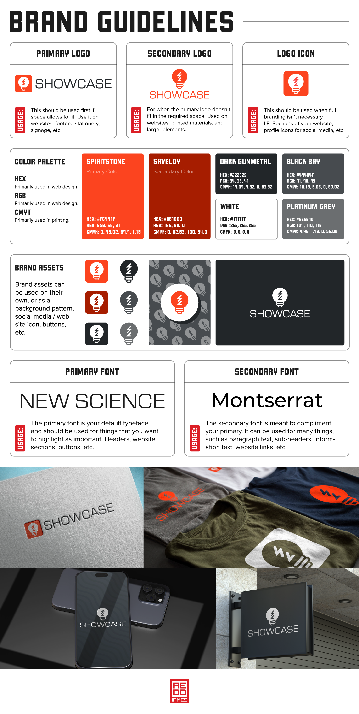
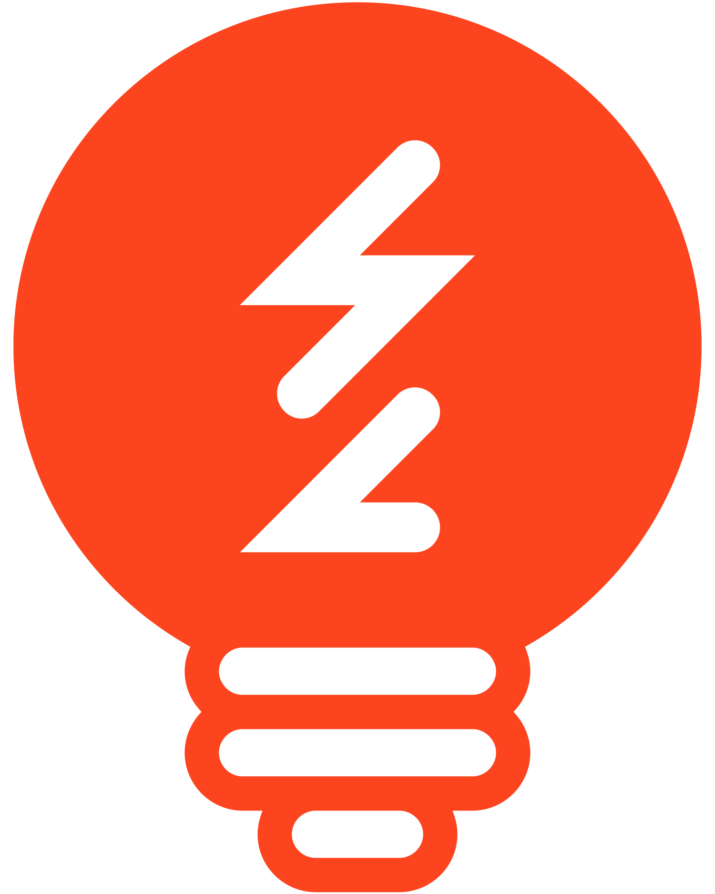

Brand guideline attached. I'd just use full dark or full light depending on the background color you're using. 

Outside of that I like to use the Logo_Icon_RED for anything that needs an icon. 

I'm not sure what size you'll need so if you need something bigger just let me know.

 29 Attachments
  •  Scanned by Gmail

James Redd (james@showcase.education)

Displaying Showcase_LOGO_BULB_GREY.png.

                            